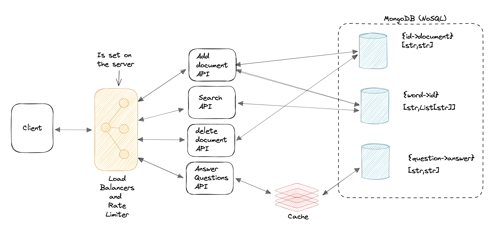

## Document Search System

**Optimal Search System for finding all documents containing search term built in Go**


**Find the python version [here](https://github.com/Xceptions/DocumentSearchEngine)**

Tools:

1. Distributed programming with goroutines and channels
2. Request caching using redis
3. NoSQL for optimal querying of database (MongoDB)
4. Backend Language: GoLang

To run:

1. Clone the repo

```
git clone https://github.com/Xceptions/DocumentSearchEngineGo.git
```

2. Start the app

```
go run .
```

3. Run tests

```
cd tests

go test -v
```
